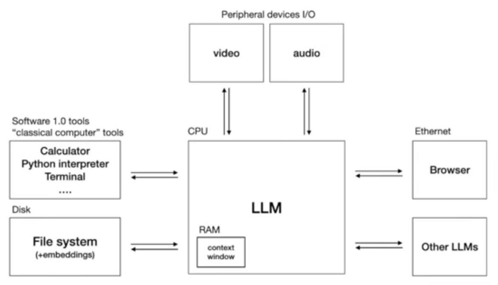

# LLM OS Experiments

This web site contains isdeas and code by Mark Watson (and hopefully more contributors once this project gets started).

## Inspiration

My initial inspiration from this project comes from Andrej Karpathy's video on YouTube [Intro to Large Language Models](https://www.youtube.com/watch?v=zjkBMFhNj_g) and specifically his overview diagram for a LLM OS:

{width:40%}

## Ideas

**LLMs may be able to engage in both System 1 and System 2 cognitive processes**.

* **System 1 processes** are fast, automatic, and instinctual. They are often accurate and less susceptible to bias.
* **System 2 processes** are slower, more deliberate, and require conscious effort. They are often less accurate but more reflective and less susceptible to bias.
* **On the surface, current-day LLMs are System 1 thinkers**. The input text is processed by consecutive layers of neural networks, which are trained to generate text that is similar to human language. This process is fast and automatic, and it does not require any deliberate reasoning or planning.
* **However, LLMs can also engage in System 2 processes**. For example, LLMs can be trained to solve math problems or answer trivia questions. This requires engaging in deliberate System 2 reasoning or possessing well-developed System 1 intuitions.
* **LLMs can also engage in chain-of-thought responses**. These responses are similar to human thinking in that they provide a step-by-step explanation of how the LLM arrived at its answer. This suggests that chain-of-thought responses not only resemble but also serve as a System 2 process.
* **In conclusion, LLMs can engage in both System 1 and System 2 cognitive processes**. This is because LLMs are not just complex statistical models; they are also trained to mimic human language and behavior.

## Software Development

I am doing preliminary development in a private GitHub repository. When I have
code that is worth sharing it will be moved to the subdirectory **LLMos** of the
GitHub repository [https://github.com/mark-watson/LLM-OS.net](https://github.com/mark-watson/LLM-OS.net)
