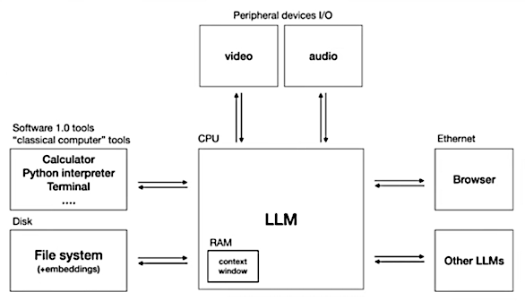

# LLM OS Experiments

This web site contains isdeas and code by Mark Watson (and hopefully more contributors once this project gets started).

## Inspiration

My initial inspiration from this project comes from Andrej Karpathy's video on YouTube [Intro to Large Language Models](https://www.youtube.com/watch?v=zjkBMFhNj_g) and specifically his overview diagram for a LLM OS:

## Software Development

